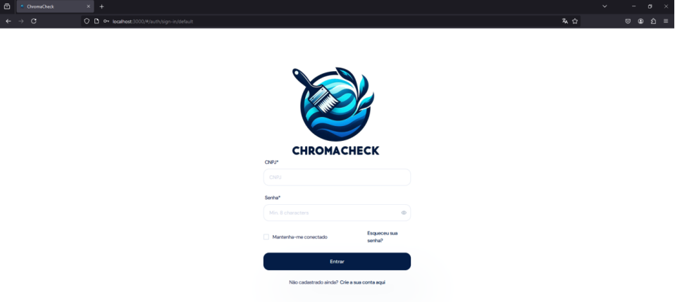
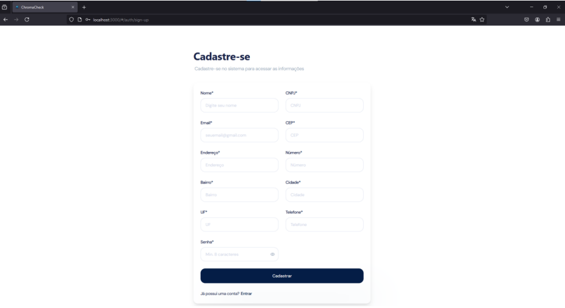
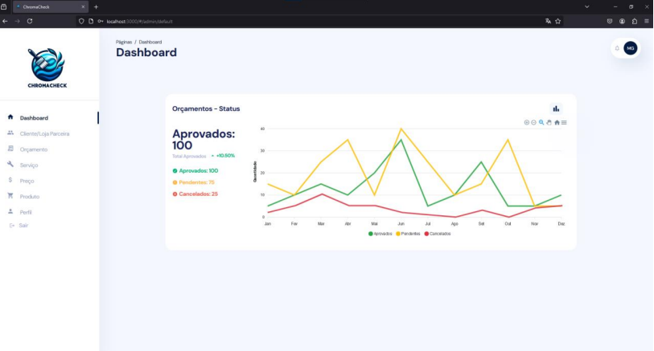
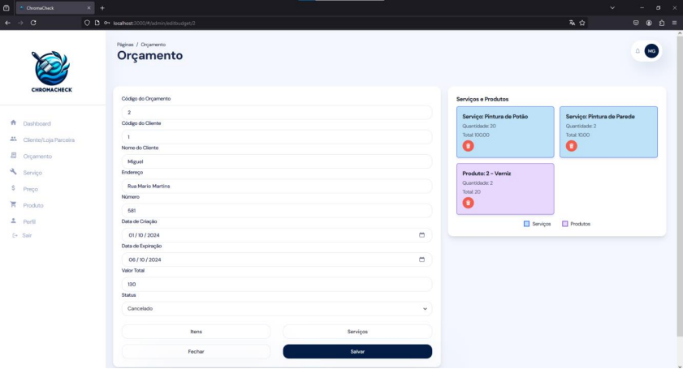
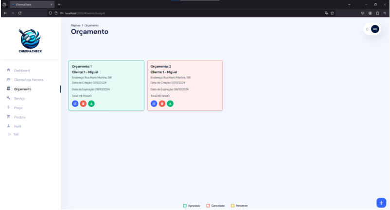

ChromaCheck - Plataforma de Orçamentos para Serviços de Pintura Residencial

📌 Descrição

Esta plataforma tem como objetivo conectar usuários/clientes a empresas prestadoras de serviço, com foco em simplificar e agilizar o processo de elaboração de orçamentos para serviços de pintura residencial. Atualmente, esse processo consome tempo e recursos excessivos, tanto para os clientes quanto para as empresas.

🚀 Objetivo

A principal missão do sistema é automatizar todas as etapas do orçamento, desde a coleta de informações até a geração e envio do orçamento final, proporcionando:

- Maior eficiência operacional
- Mais precisão e consistência nos orçamentos
- Melhor experiência para o cliente

🧩 Funcionalidades
- Coleta automatizada de dados sobre o serviço solicitado
- Geração automática de orçamentos personalizados
- Envio digital dos orçamentos para os clientes
- Interface intuitiva tanto para clientes quanto para empresas
- Integração entre usuários/clientes e empresas prestadoras de serviço

💻 Tecnologias Utilizadas
- Java – Backend robusto e escalável
- React – Interface moderna e responsiva
- Docker – Containerização do ambiente para facilitar o desenvolvimento, testes e deploy

🎯 Motivação
A criação desta plataforma nasceu da necessidade de:
- Reduzir a carga de trabalho manual
- Padronizar os orçamentos
- Aumentar a produtividade das empresas de pintura
- Tornar o processo mais ágil e transparente para os clientes

## 🖼️ Telas do Sistema

> **Observação:** As imagens a seguir representam algumas telas do sistema desenvolvidas.

## 🔐 Tela de Login

## 🏢 Cadastro de Empresa

## 📊 Dashboard

## 📝 Cadastrar Orçamento

## 🔍 Consultar Orçamentos

